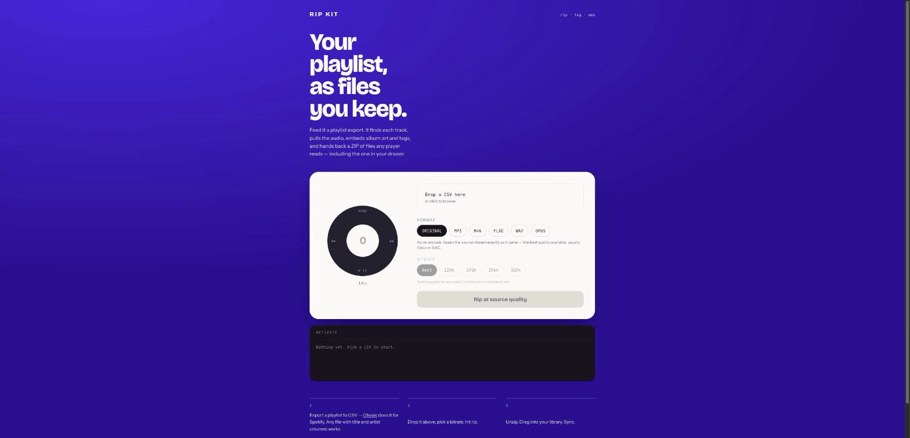

# Rip Kit

Turn a playlist CSV into a local ZIP of tagged audio files with **album art** and **metadata** (title, artist, album, year, genre). Everything runs **locally** on your machine.

Tired of streaming algorithms deciding what you should listen to? Tired of losing playlists, rising subscription prices, or limited offline access? Rip Kit lets you keep your music as files you own.



## What it does

- Takes a **playlist CSV** (Spotify, Apple Music, YouTube Music, custom, etc.)
- For each row, it:
  - Reads **title**, **artist**, **album**, **year**, **genre** (from many possible column names)
  - Searches the track on **YouTube**
  - Downloads the audio using `youtube-dl-exec` / `yt-dlp`, keeping the source stream untouched unless you asked for MP3
  - Fetches square **album art** from the **iTunes Search API**
  - Writes tags and embeds the cover with `ffmpeg`
- Zips everything into `songs.zip` for you to download from the browser

Drop a CSV and the page renders your tracklist immediately, cover art and all. Once a rip starts, the track being worked on gets promoted to its own panel — full-size album art with yt-dlp's real download percentage running across it. Finished tracks stack up underneath, newest first, each showing the codec and bitrate it actually got or the reason it failed. Long playlists load 25 rows at a time.

## Formats

There are two, on purpose.

| Format | Re-encoded? | Album art | Why it exists |
| --- | --- | --- | --- |
| **Original** (default) | No | Source-dependent | Keeps the source stream exactly as it arrived, usually Opus or AAC. Nothing beats it for quality. |
| **MP3** | Yes | Yes | Loses a little, but plays on hardware that cannot read Opus or AAC — old iPods, car stereos, cheap DAPs. ID3v2.3 + ID3v1. |

MP3 offers three bitrates: **Best** (VBR, ~245 kbps), **192k**, and **128k**. The lower two trade quality for space, which is a real choice. Rates above VBR-best are not offered, because they only pad the file.

**Why FLAC, WAV, M4A and OPUS were removed.** The source is always a lossy stream, so re-encoding it can only lose data. Measured against a 387 kbps AAC source:

| | Result | vs source |
| --- | --- | --- |
| FLAC | 2942 kbps | 7.6× the bitrate, bit-identical audio content |
| WAV | 4608 kbps | 11.9× the bitrate, bit-identical audio content |
| M4A | 386 kbps | same size, second generation of loss |
| OPUS | 270 kbps | no size win, worse compatibility than MP3 |

A lossless container around already-compressed audio does not recover anything — it just stores the damage at a higher bitrate. The app reports the real codec and bitrate of every file as it downloads, so you can check this yourself.

## How it works

- **Preview:** `POST /preview` parses the CSV and looks up cover art on iTunes, so the tracklist can render before any downloading starts
- **Upload:** the CSV is stored briefly in `uploads/` by `multer`
- **Search:** `yt-search` finds the best matching YouTube video for each track
- **Download:** `youtube-dl-exec` (yt-dlp) pulls the best audio-only stream into a temp folder like `mp3s_123456789/`. Unless you pick **Original**, yt-dlp shells out to ffmpeg to transcode into your chosen format.
- **Covers:** iTunes Search API provides square artwork, saved temporarily then embedded
- **Tagging:** a second `ffmpeg` pass (`-c copy`, no re-encode) writes the tags and attaches the cover
- **Packaging:** `archiver` builds a ZIP and streams it back to your browser

## Install & run

### Node.js

https://nodejs.org — version 18 or newer.

### ffmpeg

ffmpeg does the tagging, cover embedding, and format conversion. `ffprobe` (bundled with it) reports the real bitrate of each download.

```bash
# macOS
brew install ffmpeg

# Ubuntu / Debian
sudo apt update && sudo apt install ffmpeg

# Windows
winget install Gyan.FFmpeg
```

### Run

```bash
git clone https://github.com/drewjordan414/csv-music-downloader.git
cd csv-music-downloader

npm install
npm start          # builds the UI, then serves it at http://localhost:3000
```

For UI work, run the API and the Vite dev server side by side:

```bash
npm run server     # API on :3000
npm run dev        # UI on :5173 with hot reload, proxying to :3000
```

Check the format tagging logic without downloading anything:

```bash
node test-formats.js
```

## How to use

1. Export your playlist as a CSV — [Chosic](https://www.chosic.com/spotify-playlist-exporter/) does it for Spotify, or use any service that gives you title and artist columns
2. Open http://localhost:3000
3. Drop the CSV in — the tracklist appears with cover art before anything downloads
4. Pick a format and bitrate, hit rip, and watch each row report its own progress
5. Your browser downloads `songs.zip` with clean filenames, embedded covers, and tags

## Stack

React 19 + Vite on the front, Express 5 on the back, yt-dlp and ffmpeg doing the actual work.

## Disclaimer

This tool is intended only for personal, local use.

- Do not use this project to infringe copyright, redistribute music, or share copyrighted material without permission.
- You are solely responsible for how you use this code and for complying with your local laws and the terms of service of any platforms you access.
